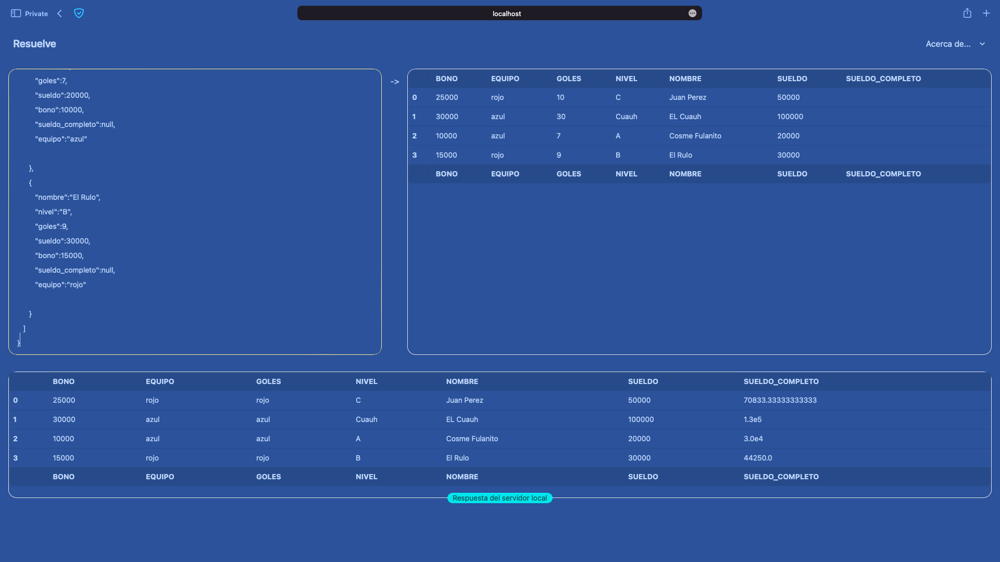

# PruebaResuelve



## Para comenzar la aplicación:
  * Instalar dependencias con `mix deps.get`
  * Arrancar la aplicación con `mix phx.server` o dentro de IEX `iex -S mix phx.server`

Ahora se puede visitar: [`localhost:4000`](http://localhost:4000) desde el navegador.

## Usar la aplicación

Se puede copiar y pegar este JSON en el input de la izquierda

```json
{
   "jugadores" : [  
      {  
         "nombre":"Juan Perez",
         "nivel":"C",
         "goles":10,
         "sueldo":50000,
         "bono":25000,
         "sueldo_completo":null,
         "equipo":"rojo"
      },
      {  
         "nombre":"EL Cuauh",
         "nivel":"Cuauh",
         "goles":30,
         "sueldo":100000,
         "bono":30000,
         "sueldo_completo":null,
         "equipo":"azul"
      },
      {  
         "nombre":"Cosme Fulanito",
         "nivel":"A",
         "goles":7,
         "sueldo":20000,
         "bono":10000,
         "sueldo_completo":null,
         "equipo":"azul"
      },
      {  
         "nombre":"El Rulo",
         "nivel":"B",
         "goles":9,
         "sueldo":30000,
         "bono":15000,
         "sueldo_completo":null,
         "equipo":"rojo"
      }
   ]
}
```

O desde una consola/terminal copiar y pegar el siguiende comando
```console
curl -H "Content-Type: application/json" -X POST \
-d '{
   "jugadores" : [
      {
         "nombre":"Juan Perez",
         "nivel":"C",
         "goles":10,
         "sueldo":50000,
         "bono":25000,
         "sueldo_completo":null,
         "equipo":"rojo"
      },
      {
         "nombre":"EL Cuauh",
         "nivel":"Cuauh",
         "goles":30,
         "sueldo":100000,
         "bono":30000,
         "sueldo_completo":null,
         "equipo":"azul"
      },
      {
         "nombre":"Cosme Fulanito",
         "nivel":"A",
         "goles":7,
         "sueldo":20000,
         "bono":10000,
         "sueldo_completo":null,
         "equipo":"azul"

      },
      {
         "nombre":"El Rulo",
         "nivel":"B",
         "goles":9,
         "sueldo":30000,
         "bono":15000,
         "sueldo_completo":null,
         "equipo":"rojo"

      }
   ]
}' \
http://localhost:4000/api/players
```

## TODO
- Pruebas / testing
- Bonus calculo nómina por equipos
